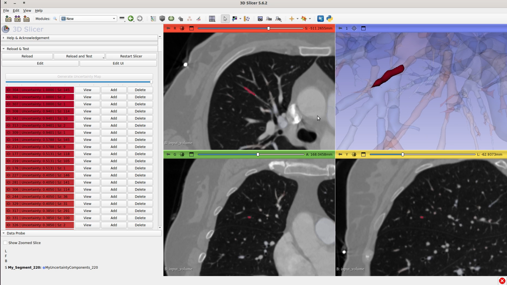
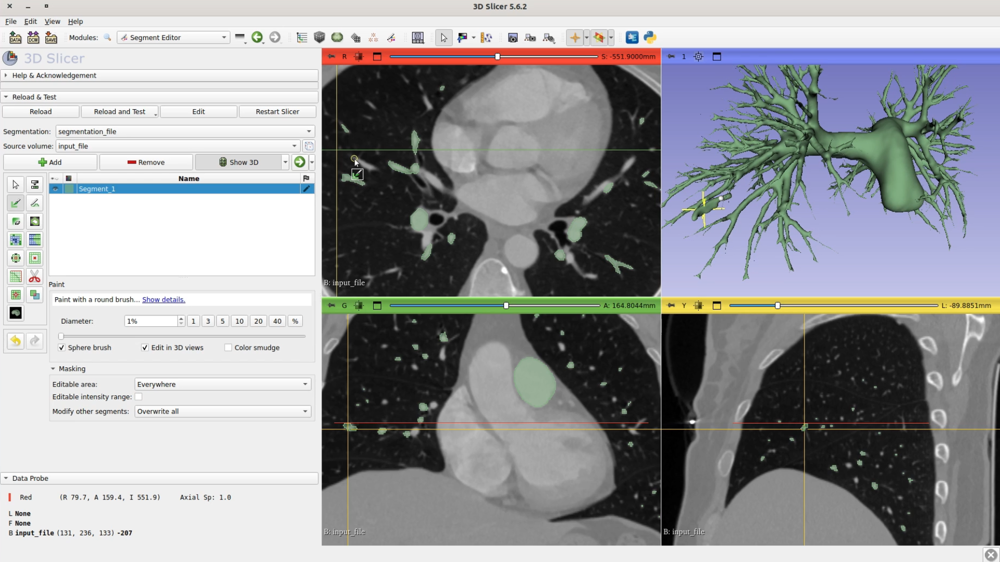

# 3d-slicer-uncertainty-visualizer
3D Slicer module for visualizing connected components along with the entire volume with functionalities of adding, deleting and viewing the individual components based on their uncertainty value.

Steps to use this module:

Clone this github repository

Slicer menu: Edit > Application Settings > Developer

Check "Enable Developer Mode"

Modules > Developer Tools > Extension Wizard

Click 'Select Extension'

Select the root folder of this github repository

Select New as the module to load

Now, after the extension and module is loaded successfully, go to Modules > Examples > New

Before clicking on "Generate Uncertainty Map", make sure you have loaded these 3 files as **Volumes**: 

1) The uncertainty file -> rename this file in the pattern \*uncertainty_file\* before loading -> load as Volume; load the float vol, not the int one

2) The segmentation file -> rename this file in the pattern \*segmentation_file\* before loading -> load as Volume

3) The image (for visualization)

Make sure none other files are loaded in slicer in the above pattern

Now you may click on the "Generate Uncertainty Map" button and start working!

The 'View' button for the 4th view (3d render) only works when the 4th view is full screen

Most code is in New.py

## Our 3D Slicer plug-in video demo

## 3D Slicer standard proof-reading tools' video demo

